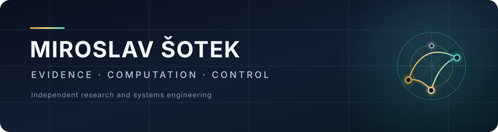

<!--
SPDX-License-Identifier: AGPL-3.0-or-later
Commercial licence available
© Concepts 1996–2026 Miroslav Šotek. All rights reserved.
© Code 2020–2026 Miroslav Šotek. All rights reserved.
ORCID: 0009-0009-3560-0851
Contact: www.anulum.li | protoscience@anulum.li
Anulum Institute — GitHub organisation profile
-->

<p align="center">
  
</p>

<p align="center">
  <a href="https://anulum.li">Website</a> ·
  <a href="https://github.com/anulum">Principal engineer</a> ·
  <a href="https://github.com/sponsors/anulum">Support open work</a> ·
  <a href="https://orcid.org/0009-0009-3560-0851">ORCID</a> ·
  <a href="https://github.com/sponsors/anulum">Support open work</a> ·
  <a href="mailto:protoscience@anulum.li">protoscience@anulum.li</a>
</p>

# Anulum Institute

Private research institute in Switzerland building **evidence-governed
infrastructure** for AI systems, multi-agent engineering, neuromorphic
computing, and control.

The Institute connects long-running independent research with reproducible
software. Claims should trace to measurements, artefacts, or executable
verification — not slogans.

Public engineering work is currently published under
[`@anulum`](https://github.com/anulum). This organisation is the institutional
catalogue and policy surface for Anulum Institute on GitHub.

## Mission

Build systems where AI-assisted and multi-agent work becomes durable only when
evidence, review separation, and machine-checkable receipts allow it.

## Lab stack

```text
Director-AI          reliability of model output
Rigor Foundry        evidence-bound audit and remediation
Synapse Channel      multi-agent coordination, claims, receipts
SC-NeuroCore         neuromorphic / SC compute (Python · Rust · RTL)
SCPN suite           control, plasma, phase, and quantum research paths
```

### Typical use

1. **Rigor Foundry** — find what is broken, unproven, or unsafe to claim.  
2. **Director-AI** — guard model output that will be trusted.  
3. **Synapse Channel** — run multi-agent work with claims, mailboxes, and receipts.  
4. **SC-NeuroCore / SCPN** — neuromorphic, physical, or control-grade compute.

## Public repositories

Primary public surfaces (hosted under the principal account until transfers
are decided):

| Project | Job | Entry |
|---|---|---|
| [Synapse Channel](https://github.com/anulum/synapse-channel) | Local-first control plane for coding-agent fleets | [docs](https://anulum.github.io/synapse-channel/) |
| [Rigor Foundry](https://github.com/anulum/rigor-foundry) | Evidence-bound repository auditing | [docs](https://anulum.github.io/rigor-foundry/) |
| [Director-AI](https://github.com/anulum/director-ai) | Real-time LLM factual-consistency guardrails | [docs](https://anulum.github.io/director-ai/) |
| [SC-NeuroCore](https://github.com/anulum/sc-neurocore) | Stochastic / neuromorphic computing framework | [docs](https://anulum.github.io/sc-neurocore/) |
| [SCPN Quantum Control](https://github.com/anulum/scpn-quantum-control) | Evidence-governed quantum simulation of synchronisation | [site](https://anulum.li/scpn-quantum-control/) |

Related control and fusion research: [scpn-control](https://github.com/anulum/scpn-control),
[scpn-fusion-core](https://github.com/anulum/scpn-fusion-core),
[scpn-phase-orchestrator](https://github.com/anulum/scpn-phase-orchestrator),
[scpn-mif-core](https://github.com/anulum/scpn-mif-core).

### Maturity language

| Label | Meaning |
|---|---|
| **Usable now** | Installable, documented, CI-backed; still evolving |
| **Research active** | Real code and ongoing science; not a stability promise |
| **Experimental** | Exploratory; do not treat interfaces or claims as fixed |
| **Evidence-bound** | Public claims are tied to measurements or artefacts |

Active development is not production readiness.

## Evidence, not slogans

Negative and null results are published when they are real. Public claims stay
tied to artefacts: measurements, preregistered protocols, raw packs, or
executable verification.

Example: preregistered quantum-control protocols and hash-bound result packs in
[scpn-quantum-control](https://github.com/anulum/scpn-quantum-control).

## Principles

- Evidence before claims.
- Reproducible artefacts before presentation.
- Clear boundaries between research, validation, and product readiness.
- Cross-language implementations where performance or hardware integration
  makes them useful.
- Honest failure records: negative results are part of the research output.

## Collaboration and contact

Technically grounded collaboration is welcome in neuromorphic systems, reliable
AI infrastructure, scientific computing, formal verification, and control.

A useful first message includes: problem, constraints, relevant prior art, and
what evidence would count as success.

- **Email:** [protoscience@anulum.li](mailto:protoscience@anulum.li)  
- **Web:** [anulum.li](https://anulum.li)  
- **Principal engineer on GitHub:** [@anulum](https://github.com/anulum)

The Institute does not take on ungrounded hype work, demo-only science theatre,
or claims that cannot be checked.

> **Transparency:** Repositories span research software, developer tools, and
> product candidates. Active development does not imply production readiness or
> scientific validation unless a project provides explicit evidence for it.

<p align="center">
  
</p>
